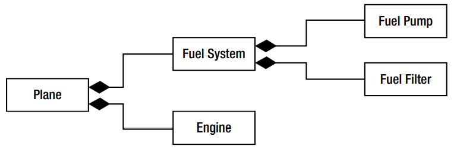

- Bu bölümde aşağıdakiler hakkında bilgi sahibi olacağız ve bu yapılar tüm kitap boyunca ele alınacak.
  1. Yazılım Tasarımının amacı
  2. UML nin temelleri
  3. SRS amacı
  4. Use Case Diagram sistemin servislerini nasıl modeller
  5. Class Diagram obje sınıflarını nasıl modeller

## Yazılım Tasarımının Amacı

- İyi organize edilmiş sistem tasarımı modern kurumsal geliştirme için önemlidir.
- Fakat birçok programcı ve yönetici buna harcanan zamanı gereksiz görüyorlar.
- Fakat tasarım sürecine zaman ayırmak aşağıdakileri sağlayacaktır.
  - Mevcut iş sürecini gözden geçirme ortaya çıkan verimsizlikleri giderme fırsatı sağlar.
  - Tüketicilerin bir yazılım sürecinin nasıl olduğu hakkında fikir sahibi olmasını sağlar.
  - Projenin kapsamı ve zaman süreci hakkında gerçekçilik sağlar.
  - Yazılımın testi için gerekli olan temelleri sağlar.
  - Yazılım hayata geçmesi için gereken zaman ve maliyeti azaltır.
- Yazılım tasarımı için en iyi anoloji benzetme.Bina yaptırmak için proje yaptırmaktır.Bir binayı yaptırmak için hemen ustaları çağırıp başlatmazsınız ence ustaların neyi nasıl yapacaklarını gösteren bir proje çizdirmenizdir.

## UML

- OOP ye dayalı bir yazılım mimarisi oluşturmanın ispatlanmış modeli UML dir.
- UML 1980 lerin başında OOPye dayalı bir yazılıma sahip olmak için standart ve sistematik bir yaklaşım olması için geliştirildi.
- UML nin birçok avantajı vardır.
  - Düzgün hazırlandığında yazılım sistemini çeşitli detay seviyelerinde görselleştirmenizi sağlar.
  - Yazılımın gereksinimlerini ve kapsamını kullanıcılarla doğrulayabilirsiniz.
  - Sistem testinin altlığı olabilir.
  - Uml yazılımın paralel geliştirilmesine olanak sağlar.Çünkü takımlar model sayesinde hangi parçanın büyük resimde ne olduğunu ve diğer parçalarla olan etkileşimini görebilirler.
- UML:
  1. Sistemin sınırlarını tanımlar
  2. Sistemin bileşenlerini(parçalarıı) tanımlar
  3. Kullanıcının sistemle olan etkileşimini tanımlar
  4. Sistemin işlevselliği açısından bileşenlerin diğer bileşenlerle olan ilişkilerini tanımlar.
- Bazı UML modelleri aşağıdaki gibidir:
  - Software Requirement Specification(SRS):Sistemin sorumluluklarının ve kapsamının yazıya dökülmüş halidir.
  - Use Case:Kullanıcının gözünden sistem davranışı nasıl olacak.İfadesi metinsel de olabilir grafiksel de olabilir.KUllanıcı bir kişi olabilir bir başka yazılım sistemide olabilir.
  - Class Diagram:Sistemi oluşturan objelerin görsel bir şablonudur.
  - Sequence Diagram:Program çalıştırıldığında sistemi oluşturan objelerin birbirleriyle olan etkileşimini sırasıyla gösteren modeldir.
  - Collaboration Diagram:Sistemin objelerinin birbirleri arasındaki iletişime odaklanır.Beraber nasıl çalıştıklarını gösterir.
  - Activity Diagram:programın çalışma akışını gösterir diyagramdır.

## SRS

- SRS in amacı :
  - Sistemin fonksiyonel gerekliliklerini tanımlamak
  - Sistemin sınırlarını tarif etmek
  - Sistem kullanıcılarını tarif etmek
  - Sistem ile kullanıcıların etkileşimini tanımlamak
  - Geliştiriciler ile müşteri arasındaki ortak dili kurmak
  - Use Case ler için altlık sağlamak
- Srs belgesini oluşturmak için son kullanıcı ve işin sahibiyle görüşmeler yapılmalı.Bu görüşmelerin amacı iş sürecini açıkça kayda almak ve sistemin sınırlarını belirlemek.
- Müşteri ile geliştiriciler arasındaki anlaşma metnidir.

## Use Case

- UML terminolojisinde actor olarak tanımlanan kişi veya başka sistemlerin sistemimizi nasıl kullanacağını tanımlar.
- Bu tanımlama kullanıcının gözünden yapılır.Kullanıcı ile sistem arasındaki etkileşime odaklanır.
- Diyagram şeklindedir.Etkileşimler metinsel olabilir.
- Use case ler SRS domümanından türerler.
- Metinsel ifadesinde:
  - Tanım
  - Öndurumlar
  - Arddurumlar yer alır.
- "Uçuş bilgilerini gör" bir use case dir.
  - Tanım:Bir müşteri uçuş bilgileri ekranını açar.Uçuş bilgileri ile ilgili bilgileri girerek arama yapar.Girdiği arama kriterleri doğrultusunda uçuş bilgi listesi görüntülenir.
  - Öndurum:Yok
  - Arddurum:Müşteri login olabilir ve uçak bileti alabilir.
- "Yer ayırt" bir use case dir.
  - Tanım:Müşteri uçuş numarısını girer ve oturma şemasını görüntüler.İstediği koltuğu işaretledikten sonra onay ekranları açılır.
  - Öndurum:Müşteri yer reserve edilmesi için önce uçuş bilgilerini görüntülemelidir.Daha sonra login olmalı ve "yer ayırt" ekranını görüntüleyebilir.
  - Arddurum:Müşterinin emailine onay kodu ve uçuş bilgileri ve iptal koşulları gönderilir.
- Yukarıda görüldüğü gibi bazı use caseler arasında ilişkiler olabilir."Yer ayırt" use case i "Uçuş bilgilerini gör" use case ini **içerir**.
- Diğer bir ilişki biçimi de **uzantı**dır.Temel bir case in başka bir use case uzantısı olabilir.Yani ondan türeyebilir.
- Yapılan yaygın bir hata sistemin kendi ürettiği davranışları use case olarak tanımlamaktır.Use caseler her zaman kullanıcı ile sistem arasındaki etkileşimi tanımlamalıdır.
- Diğer bir yaygın hata sistemin teknik gereksinimlerini use case olarak tanımlamaktır.

## Class Diagram

- Obje ve sınıf kavramları OOP nin temelidir.
- Sınıfları tanımlamanın yollarından biri SRS ve Use Case diagramlarındaki isimlendirmelerden hareket etmektir.Mesela Uçak bileti alma işleminde kullandığımız ifadelere baktığımızda.Müşteri ve Uçuş birer sınıf olabilirler.
- Sınıflar verinin yönetilmesinden sorumludur.Örneğin **Uçuş** sınıfı,uçuş numarası,kalkış zamanı,rötar,varış noktası,kapasite ve yer uygunluğunun tanımlanmasından sorumludur.Ayrıca bu verilerin değişiminden ve kullanılmasından da sorumludur.
- Class diagramları 3 ana yapıdan oluşur.
  - Sınıf ismi
  - verileri tutan property dediğimiz alan
  - bu verileri kullanan sınıfın davranışları dediğimiz method alanı
    

## Sınıf İlişkileri

- Sınıfları tanımlarken nasıl SRS dökümanının ve use case diagramların isimlendirmelerinden yardım aldıysak sınıflar arasındaki ilişkileri tanımlarken de bunların fiillerinden yardım alabiliriz.

### Association

- Eğer bir sınıf başka bir sınıfı refere ediyor veya onu kullanıyorsa bu iki sınıf arasında **association** ilişkisi vardır.
  
- Bazen bir sınıfın bir instance nın association ilişkide olduğu diğer sınıfın birçok instance ile bu ilşki kurulabilir.
  
  Şekilde görüldüğü gibi bir müşterinin birden fazla rezervasyonu olabilir.
- Bazen bir sınıfın bir instance ı aynı sınıfın diğer bir instance ile ilişkide olabilirBuna **self-association** ilişkisi denir.
  
  Örneğin Pilot sınıfının bir instance ı olan kaptan yine Pilot sınıfının bir instance ı olan yardımcı pilot ile ilişki içersindedir.

### Inheritance

- Birçok sınıf aynı davranış ve özellikleri paylaştığında,bu ortak davranış ve özellikleri içeren temel bir sınıf oluşturulur.İşte çocuk sınıflar bu temel sınıftan miras alırlar.
  

### Aggregation

- Bir sınıf diğer başka sınıfların birleşiminden oluşuyorsa bu bir **aggregation** ilişkisidir.
  
